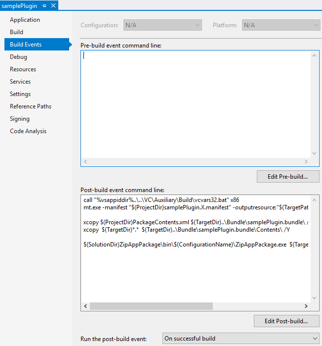

# Design Automation for Inventor sample

 This sample is .NET console app and demostrates how one can process Inventor **Assemblies** or **Parts** on Design Automation. In particular it takes design (Assembly or Part) and changes parameters inside of it (height and width). Input designs can be found in **Solution/clientApp/inputFiles/**. Values onto which are params changed are part of Program.cs

## Thumbnail

# Setup

## Prerequisites
* Visual Studio 2015 or later
* Windows 7 or later
* knowledge of C#

## Running locally

1. Register for a Forge application at https://developer.autodesk.com/myapps/create#. You'll need the key and secret for building and running any sample apps
    * Choose *Design Automation API* and *Data Mangement API*
2. Add to your env. variables
    * FORGE_CLIENT_ID
    * FORGE_CLIENT_SECRET
3. Build solution and run clientApp project
6. Outputs and Report file will be copied into My Documents folder

# Understanding sample

## Steps to do as a developer

### 1. Author Inventor plugin

Design is processed by Inventor plugin so one have to author plugin code. Result plugin is then packaged into Inventor bundle and ziped. This is done by **samplePlugin** project in solution. Packaging is done using post-build step of project. When you build the project you can find result bundle zip *samplePlugin.bundle.zip* in **Solution/Output/** directory.

### 2. Deliver you Inventor plugin to Design Automation service
 
 In order to instruct *Design Automation* service to run your plugin code, it must be delivered there. It is done by:
 
- Creating **AppBundle** object on Design Automation using REST API. You can think of **AppBundle** object as metadata describing your plugin for Design Automation usage.
- When you create **AppBundle** object, Design Automation instructs you where and how to upload your zipped and bundeled plugin binaries.

This workflow is done in this sample in **clientApp** project.

[Create AppBundle documentation](https://forge.autodesk.com/en/docs/design-automation/v3/reference/http/appbundles-POST/)

### 3. Describe your Activity

In order to use your **AppBundle** you have to create an **Activity**. In **Activity** you can describe how to handle inputs and outputs for the AppBundle. This is also done using Design Automation REST API.

This is done in this sample in **clientApp** project.

[Create Activity documentation](https://forge.autodesk.com/en/docs/design-automation/v3/reference/http/activities-POST/)

### 4. Prepare your inputs

To deliver your inputs to Design Automation process you have to upload them on internet so Design Automation downloads them when **Activity** is executed.

This workflow is done in this sample in **clientApp** project. You can find samples inputs in **Solution/clientApp/inputFiles/** folder.

### 5. Execute your Activity

To execute the activity you have to create **WorkItem**. **WorkItem** is your represantation of executed task. You can monitor it's state, so you know if it is still in progress or done. You have to specify where **Design Automation** can download inputs and where it should upload outputs (results) according to what is written in **Activity**.

This is done in this sample in **clientApp** project.

[Create WorkItem documentation](https://forge.autodesk.com/en/docs/design-automation/v3/reference/http/workitems-POST/)

### 6. Download outputs (results) and report

As mentioned earlier, your outputs are uploaded to place you specified when creating **WorkItem** and to get them onto local machine you should to download them. There is also report file where you can see what was happening.

This is done in this sample in **clientApp** project. Results are downloaded into your **Documents** folder

## Quotas and Limits
Apps, Activies and WorkItems have quotoas and limits. To find out more information on this can be found in [Docs/QuotasAndRestrictions.md](Docs/QuotasAndRestrictions.md).

## License

This sample is licensed under the terms of the [MIT License](http://opensource.org/licenses/MIT). Please see the [LICENSE](LICENSE) file for full details.

## Written by

Michal Vasicek, [Forge Partner Development](http://forge.autodesk.com)