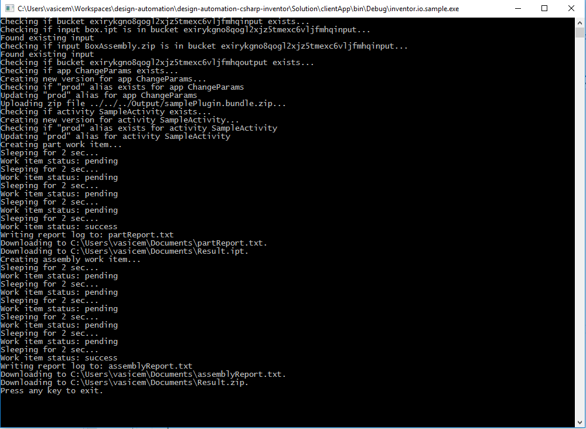

# Design Automation for Inventor sample

 This sample is a .NET console app and demonstrates how one can process Inventor **Assemblies** or **Parts** on Design Automation. In particular it takes a design (Assembly or Part) and changes parameters inside of it (height and width). Input designs can be found in **Solution/clientApp/inputFiles/**. Values for changing params are in Program.cs

## Sample Output

# Setup

## Prerequisites
* Visual Studio 2015 or later
* Windows 7 or later
* knowledge of C#

## Running locally

1. Register for a Forge application at https://forge.autodesk.com/myapps/create#. You'll need the key and secret for building and running any sample apps
    * Choose *Design Automation API* and *Data Mangement API* for the APIs you want to use in your app.
2. Add to your env. variables
    * FORGE_CLIENT_ID
    * FORGE_CLIENT_SECRET
3. Build solution and run clientApp project
6. Outputs and Report file will be copied into My Documents folder

# Understanding the sample
A detailed description of the sample is available in [Docs/DeveloperNotes.md](Docs/DeveloperNotes.md).

## How to debug samplePlugin locally

Make sure that Inventor is installed and its license is not expired. Set debugPluginLocally as startup project and start it. A new instance of Inventor will be launched. If there are any break points in the samplePlugin, the program execution will break.

## Quotas and Limits
Apps, Activies and WorkItems have quotoas and limits. To find out more information on this can be found in [Docs/QuotasAndRestrictions.md](Docs/QuotasAndRestrictions.md).

## License

This sample is licensed under the terms of the [MIT License](http://opensource.org/licenses/MIT). Please see the [LICENSE](LICENSE) file for full details.

## Written by

Michal Vasicek, [Forge Partner Development](http://forge.autodesk.com)